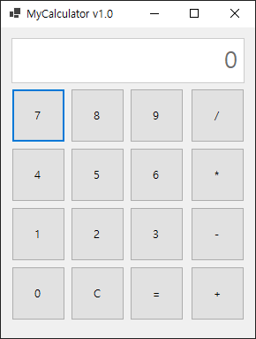
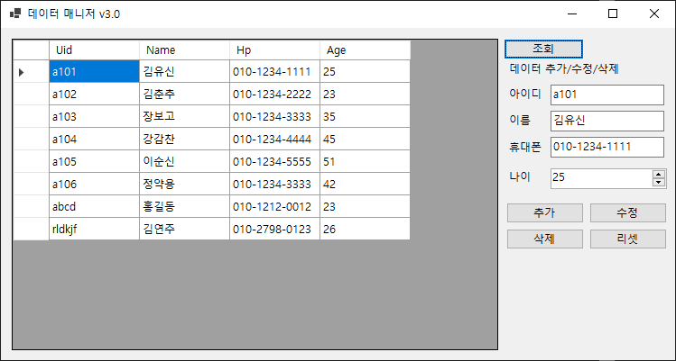

# C\# 프로그래밍

## Ch01. Hello World
## Ch02. 변수와 자료형 그리고 연산자
       - 1.변수
       - 2.자료형
       - 3.연산자
       - 4.기본입력
       - 5.자료형 변환
       - 6.문자열

## Ch03. 조건문과 반복문 그리고 배열
       - 1.조건문
       - 2.조건문
       - 3.반복문
       - 4.반복문
       - 5.배열
## Ch04. 메서드
       - 1.메서드
       - 2.메서드타입
       - 3.오버로드
       - 4.스택
       - 5.매개변수
## Ch05. 클래스
       - 1.클래스와 객체
       - 2.캡슐화
       - 3.변수와 싱클톤
       - 4.상속
       - 5.오버라이드
       - 6.다형성
## Ch06. 클래스
       - 1.추상클래스
       - 2.인터페이스
       - 3.구조체
       - 4.제네릭
       - 5.인덱서
       - 6.내장클래스
## Ch07. 컬렉션
       - 1.스택
       - 2.큐
       - 3.ArrayList
       - 4.HashTable/Dictionary
       - 5.HashSet
## Ch08. 예외처리와 입출력
       - 1.예외처리 Try
       - 2.Throw
       - 3.파일 입출력(I/O)
## Ch09. 델리게이트와 람다 그리고 데이터관리
       - 1.델리게이트
       - 2.람다
       - 3.Linq
## Ch10. 데이터베이스 프로그래밍
       - 1.DB Connection
       - 2.인서트
       - 3.셀렉트
## Ch11. 윈도우 폼
       - 1.WinForm 연습
## Project1.계산기

1. 프로젝트 유형
    - WinForm 프로젝트
2. 활용기술
    - 컨트롤
    - 이벤트와 핸들러

## Project2.데이터 매니저

1. 프로젝트 유형
    - WinForm 프로젝트
2.활용기술
    - 컨트롤
    - 이벤트와 핸들러
    - 데이터베이스와 SQL
## Project3.오목

1. 프로젝트 유형
    - WinForm 프로젝트
2. 활용기술
    - 윈도우 그래픽
    - 이벤트와 핸들러
## Project4.벽돌깨기

1. 프로젝트 유형
    - WinForm 프로젝트
2. 활용기술
    - 윈도우 그래픽
    - Timer와 핸들러
